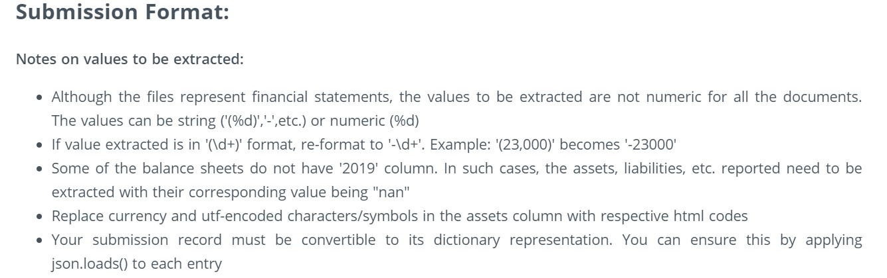

## The problem statement requires to extract assets and liabilities data from the set of files provided.

##### To extract data in desired format, I've used regular expressions and python functions to iterate through each file in a line by line manner. Here are the major steps:
##### a) Read all files one by one
##### b) Go through each line to select the starting line and ending line as we have a lot of unwanted text data above and below the data to be extracted. Regular expressions and python functions have been used extensively to extract useful information
##### c) Once the starting point and ending point are finalized, store the filtered data in a dataframe
##### d) Iterate through the dataframe values extracted above and extract key-value pairs of entity name(asset, liabilities, etc.) as key and value as the respective amount 
##### e) Store the output one by one as per the desired dictionary format and add append as a new row in output dataframe export to CSV format (same can be applied to existing dataframe but just to keep the output clean, have created a new dataframe for outcome.)

